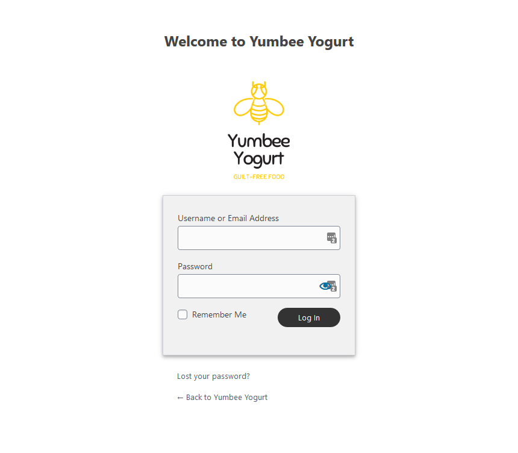

## WP Custom login logo

#### Description

<p>Customize your WordPress login page and add your own logo to the WordPress admin login page!</p>

<p>WordPress uses CSS to display a background image the WordPress logo in the link inside the heading tag You can use the login_enqueue_scripts hook to insert CSS into the head of the login page so your logo loads instead:</p>

before:


### How to use

<p><strong>Step 1. add logo as normal in WordPress dashboard</strong> <code>Appearance > Customise > Site Identity</code></p>
<p><strong>Step 2. Install plugin</strong></p>

<p><i>or if you can insert below code in</i> <code>functions.php</code></p>

**Add the below function:**

```javascript
<?php

// Custom logo support for admin login page
add_theme_support('custom-logo');


function my_login_logo()
{

    $custom_logo_id = get_theme_mod('custom_logo');
    $image = wp_get_attachment_image_src($custom_logo_id, 'full'); ?>

    <h1 id="welcome-login">Welcome to <?php bloginfo('name'); ?></h1>

    <style type="text/css">
        .login-action-login {
            background: #fff !important;
        }

        .wp-core-ui #login {
            padding: 0 !important;
        }

        #welcome-login {
            display: flex;
            justify-content: center;
            align-content: center;
            font-size: 24px !important;
            padding-top: 50px;
        }

        #login h1 a,
        .login h1 a {
            height: 185px;
            width: auto;
            padding-bottom: 30px;
            background-image: url(<?php echo $image[0]; ?>);
            background-size: cover;
            background-repeat: no-repeat;
        }

        .login form {
            background: #f1f1f1 !important;
            border: 1px solid #eee;
            -webkit-box-shadow: 0 2px 4px -1px rgba(0, 0, 0, 0.2),
                0 4px 5px 0 rgba(0, 0, 0, 0.14), 0 1px 10px 0 rgba(0, 0, 0, 0.12) !important;
            box-shadow: 0 2px 4px -1px rgba(0, 0, 0, 0.2), 0 4px 5px 0 rgba(0, 0, 0, 0.14),
                0 1px 10px 0 rgba(0, 0, 0, 0.12) !important;
        }

        .wp-core-ui .button,
        .wp-core-ui .button.button-large {
            padding: 0 34px !important;
            background-color: #333;
            border-radius: 40px;
            border: none;
        }

        .wp-core-ui .button-primary:hover {
            background-color: #333 !important;
            opacity: 0.8 !important;
        }
    </style>

<?php }
add_action('login_enqueue_scripts', 'my_login_logo');


```

after:

Adds new welcome greeting (from site name), and new styles


